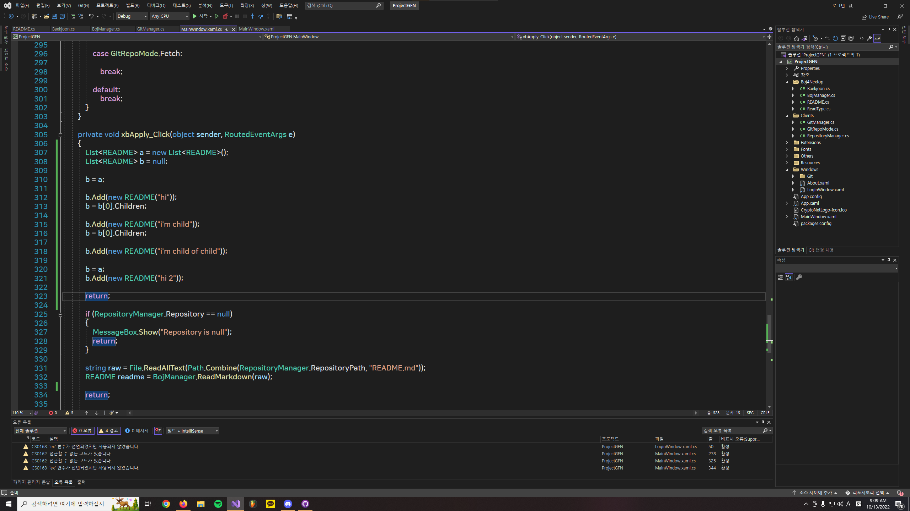

# 프랙탈 리스트
## 원리

- 사진 참고

A와 Child라는 List가 있다고 하자.

A를 Child에 대입한다. `Child = A`

그리고 Child에 아이템을 추가한다. `Child.Add(item1)`

그러면 A에는 item1이 추가된다.

여기서 주의할 점은 C++에 있는 vector copy 방식이 아니라는 것이다.

ex) `vector<T> v = v2`

item1의 Child를 Child에 대입하고 `item1.Child = Child`

Child에 아이템을 추가하면 `Child.Add(item2)`

A에는 item1이 있고 item1에는 item2가 있는 것이다.

최종적으로는

A

ㄴ item1
    
    ㄴ item2

이렇게 Tree가 형성된다.

더 자세한 설명은 직접 알아보도록 하자.
- [UniConverter](https://github.com/MineEric64/UniConverter-Project) 프로젝트에 있는 소스 코드 MainProject.vb에 있는 함수 `ConvertKeyLEDForMIDEX_v2()`
- [Git4Nextop](https://github.com/MineEric64/Git4Nextop) 프로젝트에 있는 소스 코드 BojManager.cs에 있는 함수

에 프랙탈 리스트가 적용되어 있다.