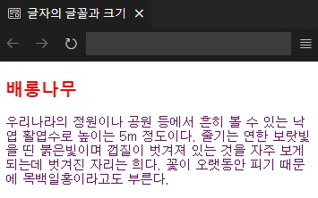

# HTMLTML
HTML & CSS

|[.html](../HTMLTML/caph5/.html)|p|HTML 7 CSS|2/12/2022||.|
|[0.html](../HTMLTML/caph5/pp/0.html)|p|HTML 7 CSS|2/12/2022||.|

## [챕터 1](../../../tree/main/HTMLTML/cahp1)
|소스 코드|페이지 수|언어|날짜|결과|설명|
|:---:|:---:|:---:|:---:|:---:|:---:|
|[index.html](../HTMLTML/cahp1/index.html)|32p|HTML|2/5/2022||.|
|[hello.html](../HTMLTML/cahp1/hello.html)|34~35p|HTML|2/5/2022||.|
|[charset.html](../HTMLTML/cahp1/charset.html)|36~37p|HTML|2/5/2022||.|
|[attribute.html](../HTMLTML/cahp1/attribute.html)|38~39p|HTML|2/5/2022||.|
|"|"|"|"||링크 클릭 시|

## [챕터 2](../../../tree/main/HTMLTML/cahp2)
|소스 코드|페이지 수|언어|날짜|결과|설명|
|:---:|:---:|:---:|:---:|:---:|:---:|
|[h1.html](../HTMLTML/cahp2/h1.html)|44p|HTML|2/5/2022||.|
|[h1_h6.html](../HTMLTML/cahp2/h1_h6.html)|45p|HTML|2/5/2022||.|
|[no_br.html](../HTMLTML/cahp2/no_br.html)|46p|HTML|2/5/2022||.|
|[br.html](../HTMLTML/cahp2/br.html)|47~48p|HTML|2/5/2022||.|
|[p.html](../HTMLTML/cahp2/p.html)|48~49p|HTML|2/5/2022||.|
|[ul_li.html](../HTMLTML/cahp2/ul_li.html)|50~52p|HTML|2/5/2022||.|
|[ol_li.html](../HTMLTML/cahp2/ol_li.html)|52~53p|HTML|2/5/2022||.|
|[dl_dt_dd.html](../HTMLTML/cahp2/dl_dt_dd.html)|53~54p|HTML|2/5/2022||.|
|[index.html](../HTMLTML/cahp2/index.html)|55~57p|HTML|2/5/2022||.|
|[page1.html](../HTMLTML/cahp2/page1.html)|57p|HTML|2/5/2022||.|
|[html_comment.html](../HTMLTML/cahp2/html_comment.html)|58p|HTML|2/5/2022||.|

### [연습 문제](../../../tree/main/HTMLTML/cahp2/pp)
|소스 코드|페이지 수|언어|날짜|결과|설명|
|:---:|:---:|:---:|:---:|:---:|:---:|
|[01.html](../HTMLTML/cahp2/pp/01.html)|62p|HTML|2/5/2022||.|
|[02.html](../HTMLTML/cahp2/pp/02.html)|63p|HTML|2/5/2022||.|
|[03.html](../HTMLTML/cahp2/pp/03.html)|64p|HTML|2/5/2022||.|

## [챕터 3](../../../tree/main/HTMLTML/caph3)
|소스 코드|페이지 수|언어|날짜|결과|설명|
|:---:|:---:|:---:|:---:|:---:|:---:|

### [연습 문제](../../../tree/main/HTMLTML/caph3/pp)
|소스 코드|페이지 수|언어|날짜|결과|설명|
|:---:|:---:|:---:|:---:|:---:|:---:|

## [챕터 4](../../../tree/main/HTMLTML/caph4)
|소스 코드|페이지 수|언어|날짜|결과|설명|
|:---:|:---:|:---:|:---:|:---:|:---:|

### [연습 문제](../../../tree/main/HTMLTML/caph4/pp)
|소스 코드|페이지 수|언어|날짜|결과|설명|
|:---:|:---:|:---:|:---:|:---:|:---:|

## [챕터 5](../../../tree/main/HTMLTML/caph5)
|소스 코드|페이지 수|언어|날짜|결과|설명|
|:---:|:---:|:---:|:---:|:---:|:---:|
|[css_syntax.html](../HTMLTML/caph5/css_syntax.html)|110~111p|HTML 7 CSS|2/12/2022||.|
|[inline_style.html](../HTMLTML/caph5/inline_style.html)|111~112p|HTML 7 CSS|2/12/2022||.|
|[internal_style.html](../HTMLTML/caph5/internal_style.html)|113p|HTML 7 CSS|2/12/2022||.|
|[external_style.html](../HTMLTML/caph5/external/html/external_style.html)|113~114p|HTML|2/12/2022||CSS 미적용 시|
|[mystyle.css](../HTMLTML/caph5/external/css/mystyle.css)|113~114p|CSS|2/12/2022||CSS 적용 시|
|[color.html](../HTMLTML/caph5/color.html)|115~116p|HTML 7 CSS|2/12/2022||.|
|[text_align.html](../HTMLTML/caph5/text_align.html)|116~118p|HTML 7 CSS|2/12/2022||.|
|[text_shadow.html](../HTMLTML/caph5/text_shadow.html)|118~119p|HTML 7 CSS|2/12/2022||.|
|[font_family.html](../HTMLTML/caph5/font_family.html)|119~120p|HTML 7 CSS|2/12/2022||.|
|[font_style.html](../HTMLTML/caph5/font_style.html)|121~122p|HTML 7 CSS|2/12/2022||.|
|[css_link.html](../HTMLTML/caph5/css_link.html)|127~128p|HTML 7 CSS|2/12/2022||방문하기 전의 링크 텍스트|
|"|"|"|"||링크 텍스트를 마우스 포인터를 갖다 댄 상태|
|"|"|"|"||링크 텍스트를 마우스로 클릭한 순간|
|"|"|"|"||링크 텍스트를 한 번 이상 클릭한 경우|

### [연습 문제](../../../tree/main/HTMLTML/caph5/pp)
|소스 코드|페이지 수|언어|날짜|결과|설명|
|:---:|:---:|:---:|:---:|:---:|:---:|
|[01.html](../HTMLTML/caph5/pp/01.html)|131~132p|HTML 7 CSS|2/12/2022||.|

## [챕터 6](../../../tree/main/HTMLTML/caph6)
|소스 코드|페이지 수|언어|날짜|결과|설명|
|:---:|:---:|:---:|:---:|:---:|:---:|

### [연습 문제](../../../tree/main/HTMLTML/caph6/pp)
|소스 코드|페이지 수|언어|날짜|결과|설명|
|:---:|:---:|:---:|:---:|:---:|:---:|

## [챕터 7](../../../tree/main/HTMLTML/caph7)
|소스 코드|페이지 수|언어|날짜|결과|설명|
|:---:|:---:|:---:|:---:|:---:|:---:|

### [연습 문제](../../../tree/main/HTMLTML/caph7/pp)
|소스 코드|페이지 수|언어|날짜|결과|설명|
|:---:|:---:|:---:|:---:|:---:|:---:|

## [챕터 8](../../../tree/main/HTMLTML/caph8)
|소스 코드|페이지 수|언어|날짜|결과|설명|
|:---:|:---:|:---:|:---:|:---:|:---:|

### [연습 문제](../../../tree/main/HTMLTML/caph8/pp)
|소스 코드|페이지 수|언어|날짜|결과|설명|
|:---:|:---:|:---:|:---:|:---:|:---:|

## TODO
- 99p 회원가입 형식 만들어보기
