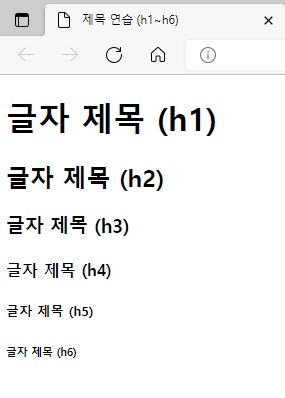
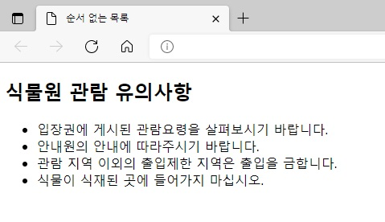
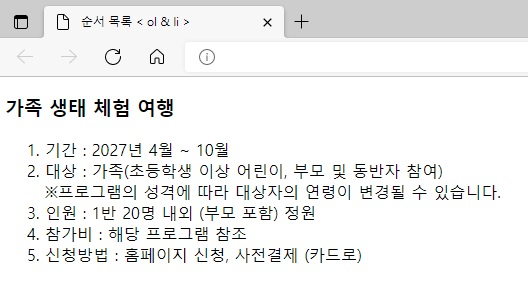
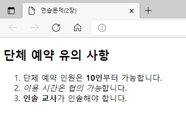

## 챕터 2
|소스 코드|페이지 수|언어|날짜|결과|설명|
|:---:|:---:|:---:|:---:|:---:|:---:|
|[h1.html](../cahp2/h1.html)|44p|HTML|2/5/2022||.|
|[h1_h6.html](../cahp2/h1_h6.html)|45p|HTML|2/5/2022||.|
|[no_br.html](../cahp2/no_br.html)|46p|HTML|2/5/2022||.|
|[br.html](../cahp2/br.html)|47~48p|HTML|2/5/2022||.|
|[p.html](../cahp2/p.html)|48~49p|HTML|2/5/2022||.|
|[ul_li.html](../cahp2/ul_li.html)|50~52p|HTML|2/5/2022||.|
|[ol_li.html](../cahp2/ol_li.html)|52~53p|HTML|2/5/2022||.|
|[dl_dt_dd.html](../cahp2/dl_dt_dd.html)|53~54p|HTML|2/5/2022||.|
|[index.html](../cahp2/index.html)|55~57p|HTML|2/5/2022||page1의 '홈으로' 버튼을 클릭 시|
|"|"|"|"||index의 'Click to search with Google' 버튼을 클릭 시|
|"|"|"|"||index의 'Click to watch the video with Youtube' 버튼을 클릭 시|
|[page1.html](../cahp2/page1.html)|57p|HTML|2/5/2022||index의 '꽃잔디' 버튼을 클릭 시|
|[html_comment.html](../cahp2/html_comment.html)|58p|HTML|2/5/2022||.|

### [연습 문제](../../../tree/main/HTMLTML/cahp2/pp)
|소스 코드|페이지 수|언어|날짜|결과|설명|
|:---:|:---:|:---:|:---:|:---:|:---:|
|[01.html](../cahp2/pp/01.html)|62p|HTML|2/5/2022||.|
|[02.html](../cahp2/pp/02.html)|63p|HTML|2/5/2022||.|
|[03.html](../cahp2/pp/03.html)|64p|HTML|2/5/2022||.|