## 챕터 10
|소스 코드|페이지 수|언어|날짜|결과|설명|
|:---:|:---:|:---:|:---:|:---:|:---:|
|[no_float.html](./no_float.html)|250~251p|HTML 7 CSS|3/5/2022|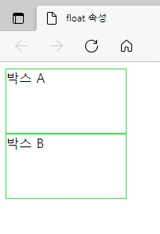|.|
|[float.html](./float.html)|251~252p|HTML 7 CSS|3/5/2022|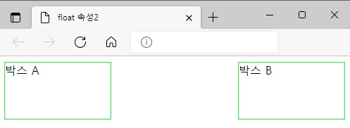|.|
|[image_layout1.html](./image_layout1.html)|252~254p|HTML 7 CSS|3/5/2022|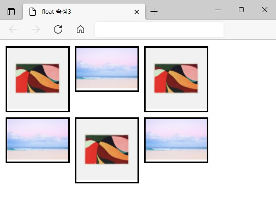|.|
|[image_layout2.html](./image_layout2.html)|254p|HTML 7 CSS|3/5/2022|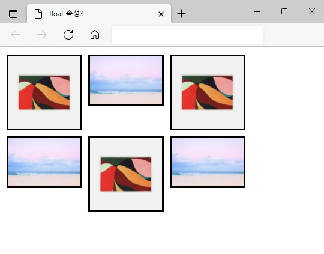|.|
|[clear.html](./clear.html)|255~256p|HTML 7 CSS|3/5/2022|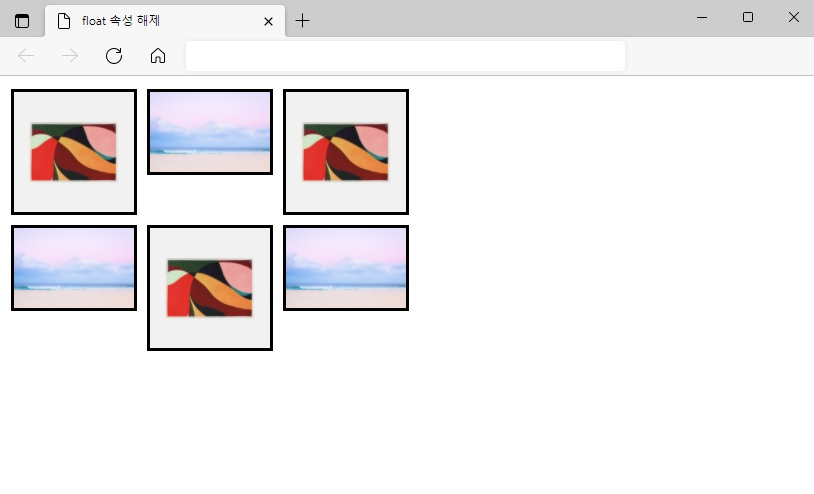|.|
|[float_layout.html](./float_layout.html)|257~259p|HTML 7 CSS|3/5/2022||.|
|[roll_screen.html](./roll_screen.html)|260~263p|HTML 7 CSS|3/5/2022|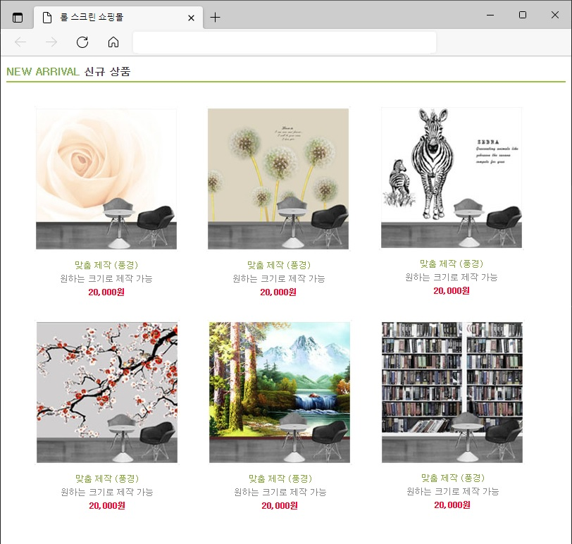|.|
|[position1.html](./position1.html)|276~277p|HTML 7 CSS|3/12/2022|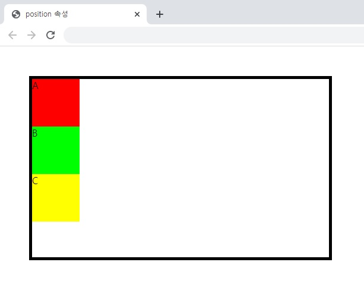|.|
|[position2.html](./position2.html)|277~278p|HTML 7 CSS|3/12/2022|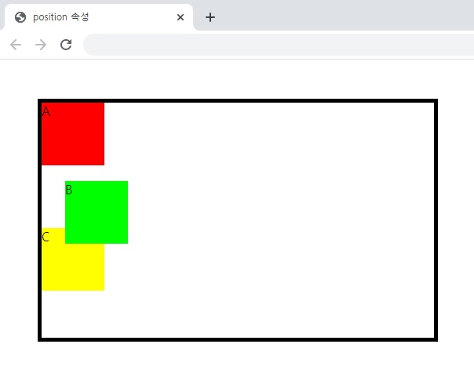|.|
|[position3.html](./position3.html)|278~279p|HTML 7 CSS|3/12/2022|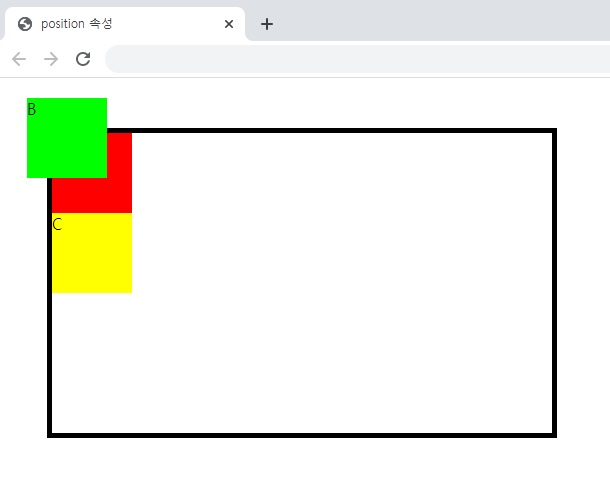|.|
|[position4.html](./position4.html)|279~280p|HTML 7 CSS|3/12/2022|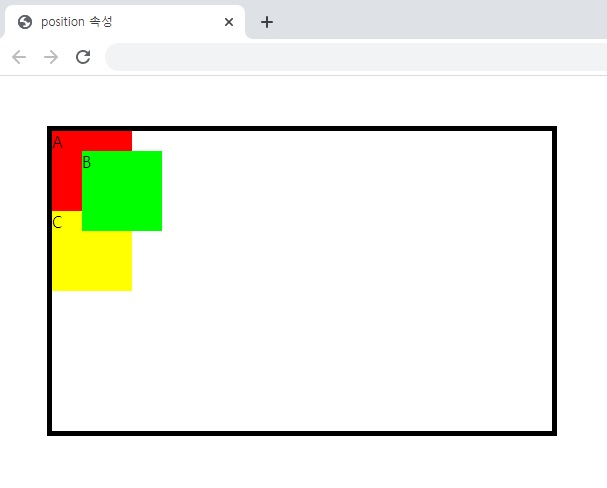|.|
|[position_layout.html](./position_layout.html)|280~283p|HTML 7 CSS|3/12/2022|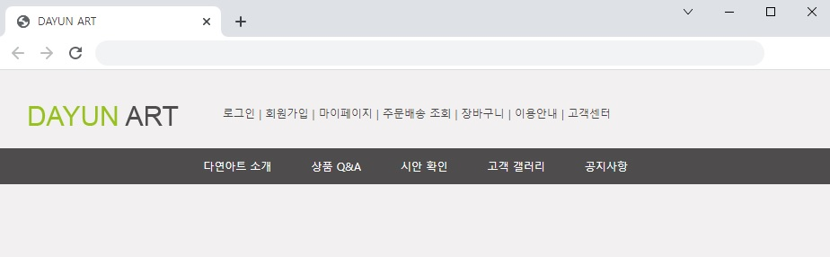|.|

### [연습 문제](../../../../tree/main/HTMLTML/caph10/pp)
|소스 코드|페이지 수|언어|날짜|결과|설명|
|:---:|:---:|:---:|:---:|:---:|:---:|
|[01.html](./pp/01.html)|p|HTML 7 CSS|3/12/2022|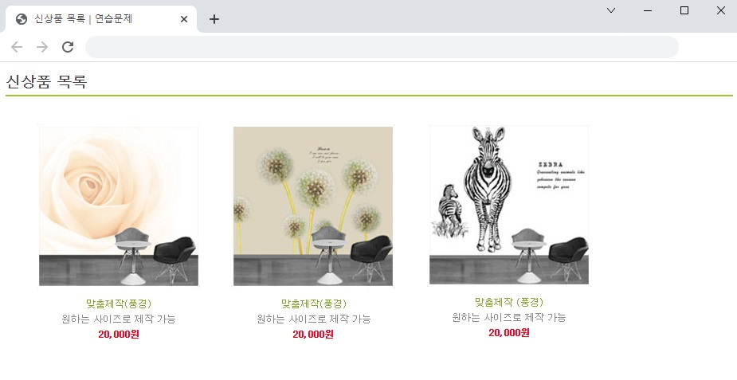|.|