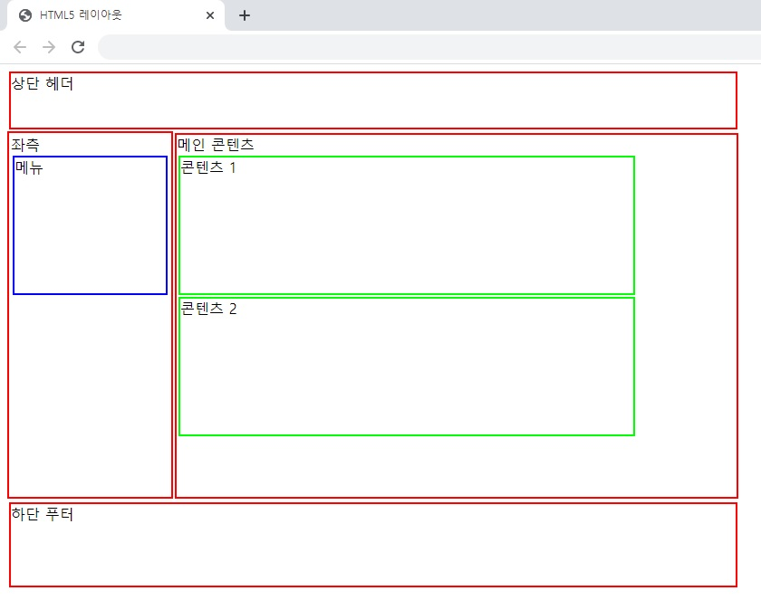
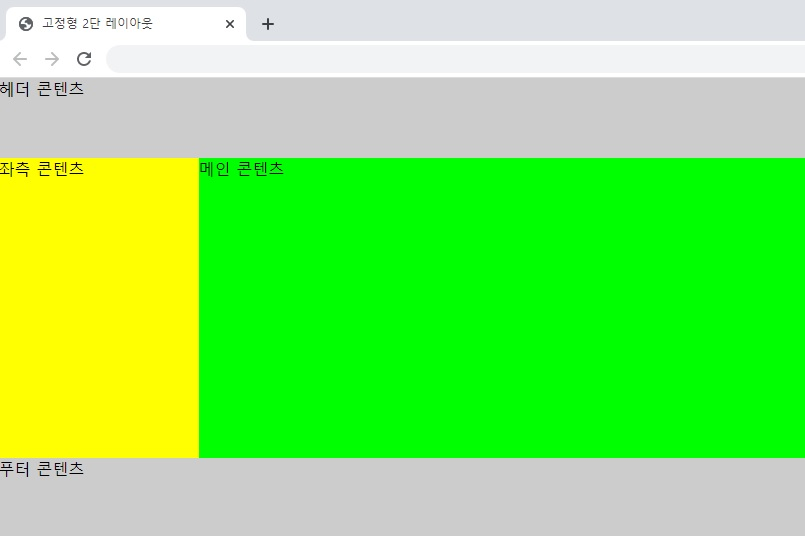
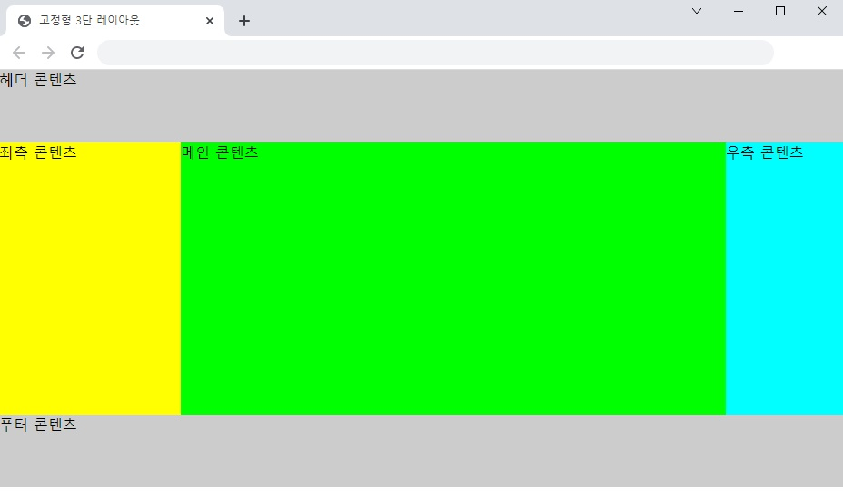
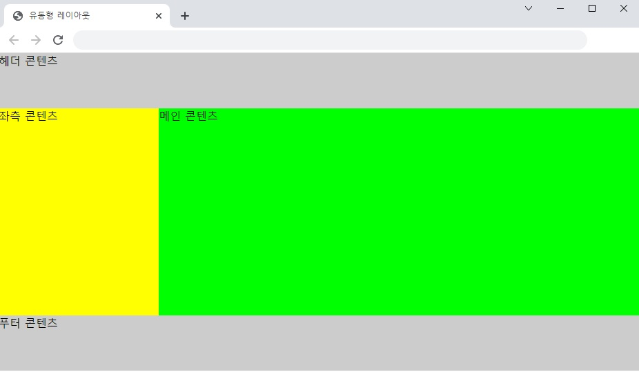
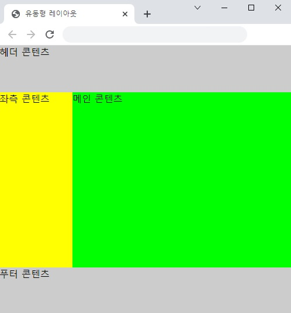
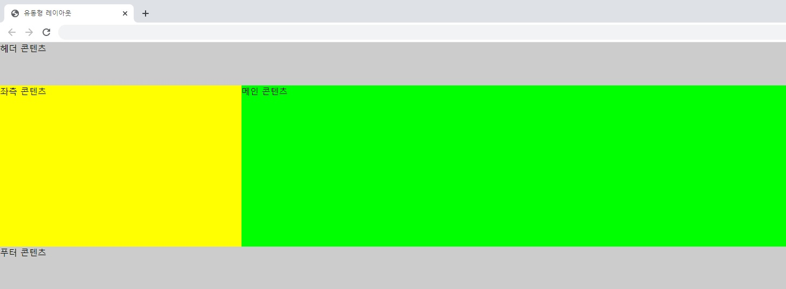
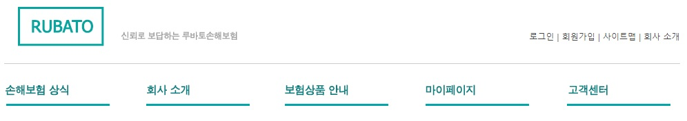
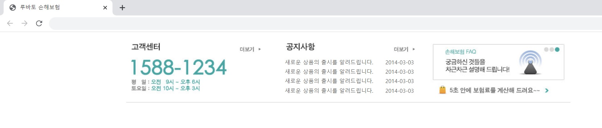
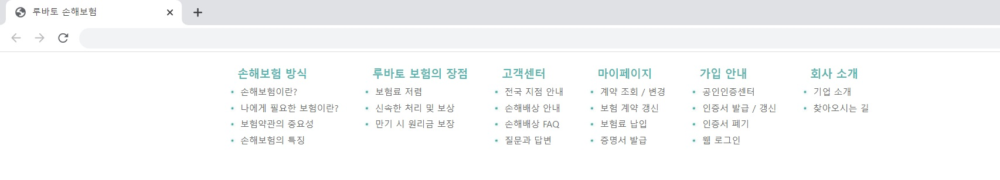

## 챕터 11
|소스 코드|페이지 수|언어|날짜|결과|설명|
|:---:|:---:|:---:|:---:|:---:|:---:|
|[html5_layout.html](../caph11/html5_layout.html)|294~298p|HTML 7 CSS|3/12/2022||.|
|[fixed_2col.html](../caph11/fixed_2col.html)|299~302p|HTML 7 CSS|3/12/2022||.|
|[fixed_3col.html](../caph11/fixed_3col.html)|302~304p|HTML 7 CSS|3/12/2022||.|
|[part_fixed_2col.html](../caph11/part_fixed_2col.html)|305~307p|HTML 7 CSS|3/12/2022||.|
|[flexible_2col.html](../caph11/flexible_2col.html)|307~309p|HTML 7 CSS|3/12/2022||.|
|"|"|"|"||.|
|"|"|"|"||.|
|[header.html](../caph11/html/header.html)|312~315p|HTML 7 CSS|3/20/2022||.|
|[banner.html](../caph11/html/banner.html)|316~318p|HTML 7 CSS|3/20/2022||.|
|[customer_notice_faq.html](../caph11/customer_notice_faq.html)|318~321p|HTML 7 CSS|3/27/2022||.|
|[sitemap.html](../caph11/sitemap.html)|322~325p|HTML 7 CSS|3/27/2022||.|

### [연습 문제](../../../../tree/main/HTMLTML/caph11/pp)
|소스 코드|페이지 수|언어|날짜|결과|설명|
|:---:|:---:|:---:|:---:|:---:|:---:|
