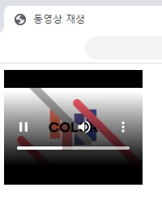
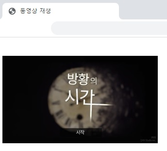
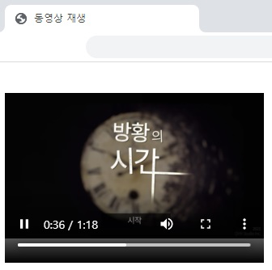

## 챕터 3
|소스 코드|페이지 수|언어|날짜|결과|설명|
|:---:|:---:|:---:|:---:|:---:|:---:|
|[image.html](./image.html)|66~68p|HTML|2/5/2022||.|
|[image_attribute.html](./image_attribute.html)|68~69p|HTML|2/5/2022||.|
|"|"|"|"||COLOURIZE (1)을 마우스에 갖다댈 시|
|"|"|"|"||COLOURIZE (2)을 마우스에 갖다댈 시|
|"|"|"|"||COLOURIZE (3)을 마우스에 갖다댈 시|
|[absolute_url.html](./absolute_url.html)|70~71p|HTML|2/5/2022||.|
|[relative_url.html](./relative_url.html)|71~73p|HTML|2/5/2022||.|
|[embed_mp4.html](./embed_mp4.html)|74p|HTML|2/5/2022||동영상 재생 시 (embed)|
|"|"|"|"||동영상 바 (embed)|
|[audio.html](./audio.html)|75~76p|HTML|2/5/2022||.|
|[video.html](./video.html)|76~77p|HTML|2/5/2022||동영상 재생 시|
|"|"|"|"||동영상 바|

### [연습 문제](../../../../tree/main/HTMLTML/caph3/pp)
|소스 코드|페이지 수|언어|날짜|결과|설명|
|:---:|:---:|:---:|:---:|:---:|:---:|
|[02.html](./pp/02.html)|80p|HTML|2/5/2022||.|

### 출처
|소스 이름|소스 설명|링크|설명|
|:---:|:---:|:---:|
|[embed_mp4.html](./embed_mp4.html)||https://youtu.be/csyxTr0qe-o|[Motion Graphic] HELLO by D1VERSE|
|[audio.html](./audio.html)||https://youtu.be/S-ROrE2mE7w|Flutes Will Chill by Kicktracks|
|[video.html](./video.html)||https://youtu.be/fgHYNZb31DA|방황의 시간 - 메뉴 화면 by y oshi|