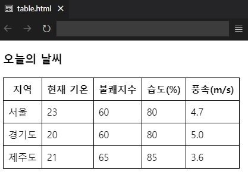

## 챕터 4
|소스 코드|페이지 수|언어|날짜|결과|설명|
|:---:|:---:|:---:|:---:|:---:|:---:|
|[table.html](./table.html)|82~84p|HTML|2/12/2022||.|
|[cell_merge.html](./cell_merge.html)|84~86p|HTML|2/12/2022||.|
|[input_text.html](./input_text.html)|90~91p|HTML|2/12/2022||.|
|[input_password.html](./input_password.html)|91p|HTML|2/12/2022||.|
|[input_radio.html](./input_radio.html)|92p|HTML|2/12/2022||공개 선택 시|
|"|"|"|"||비공개 선택 시|
|[input_checkbox.html](./input_checkbox.html)|93p|HTML|2/12/2022||.|
|"|"|"|"||사용자가 직접 맞춤 설정 가능|
|[select_option.html](./select_option.html)|93~94p|HTML|2/12/2022||.|
|[textarea.html](./textarea.html)|94~95p|HTML|2/12/2022||.|
|[button.html](./button.html)|95~96p|HTML|2/12/2022||.|
|[input_file.html](./input_file.html)|97p|HTML|2/12/2022||.|
|"|"|"|"||파일 선택 버튼 클릭 시|
|"|"|"|"||팝업 창 열기 버튼 클릭 시|
|[html5_form.html](./html5_form.html)|98p|HTML|2/12/2022||.|
|"|"|"|"||사용자가 직접 맞춤 설정 가능|

### [연습 문제](../../../../tree/main/HTMLTML/caph4/pp)
|소스 코드|페이지 수|언어|날짜|결과|설명|
|:---:|:---:|:---:|:---:|:---:|:---:|
|[01.html](./pp/01.html)|104p|HTML|2/12/2022||.|
|[02.html](./pp/02.html)|105~106p|HTML|2/12/2022||.|