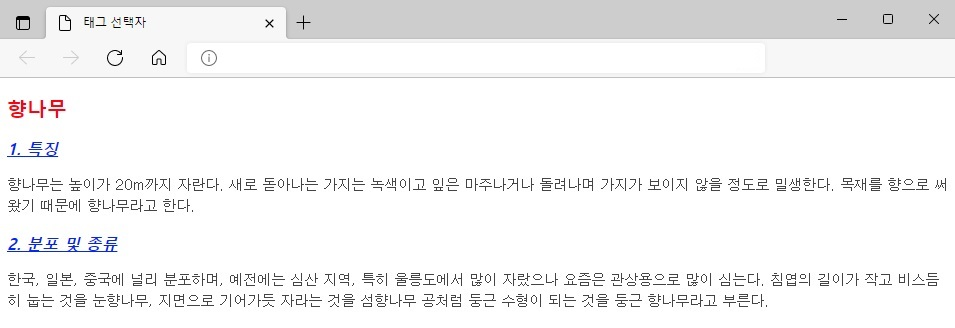

## 챕터 6
|소스 코드|페이지 수|언어|날짜|결과|설명|
|:---:|:---:|:---:|:---:|:---:|:---:|
|[tag_selector.html](../caph6/tag_selector.html)|134~136p|HTML 7 CSS|2/19/2022||.|
|[id_selector.html](../caph6/id_selector.html)|136~138p|HTML 7 CSS|2/19/2022||.|
|[class_selector1.html](../caph6/class_selector1.html)|138~139p|HTML 7 CSS|2/19/2022||.|
|[class_selector2.html](../caph6/class_selector2.html)|140~141p|HTML 7 CSS|2/19/2022||.|
|[descendant_selector.html](../caph6/descendant_selector.html)|142~143p|HTML 7 CSS|2/19/2022||.|
|[css_comment.html](../caph6/css_comment.html)|144~146p|HTML 7 CSS|2/19/2022||.|