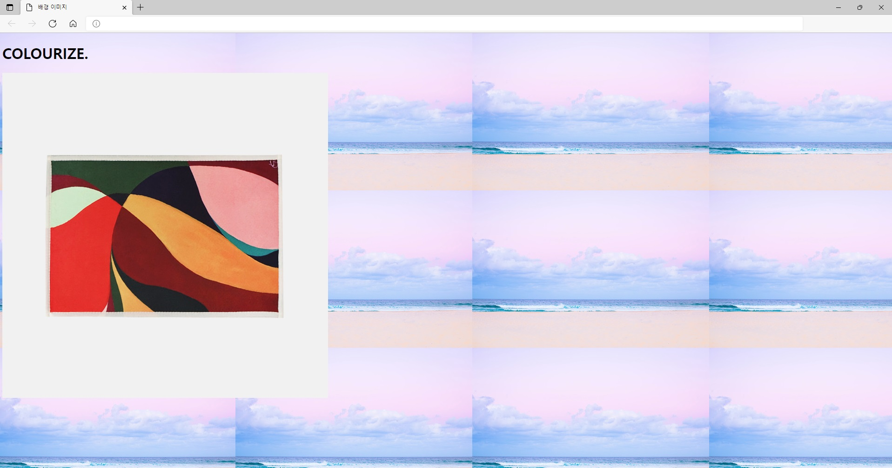
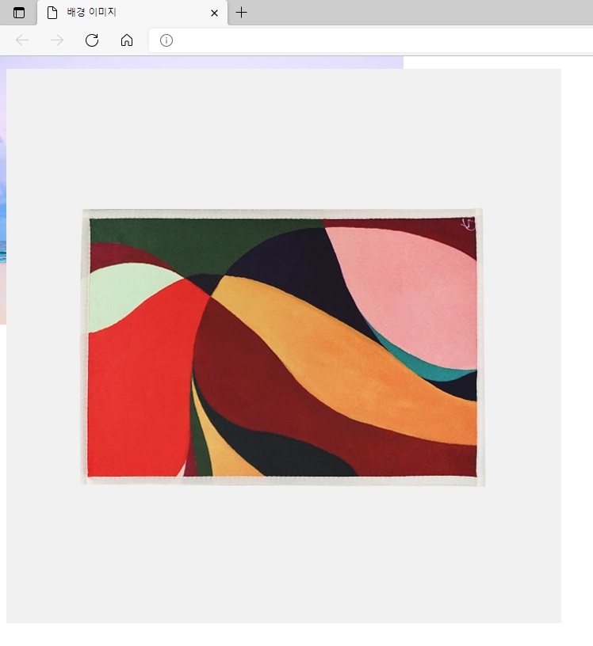
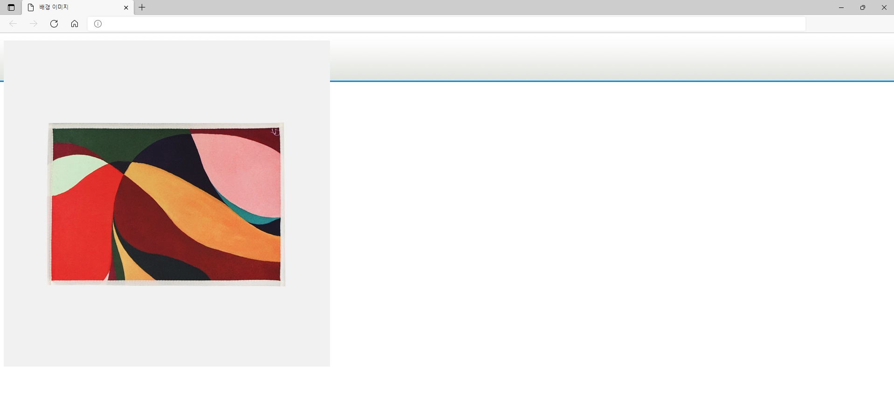
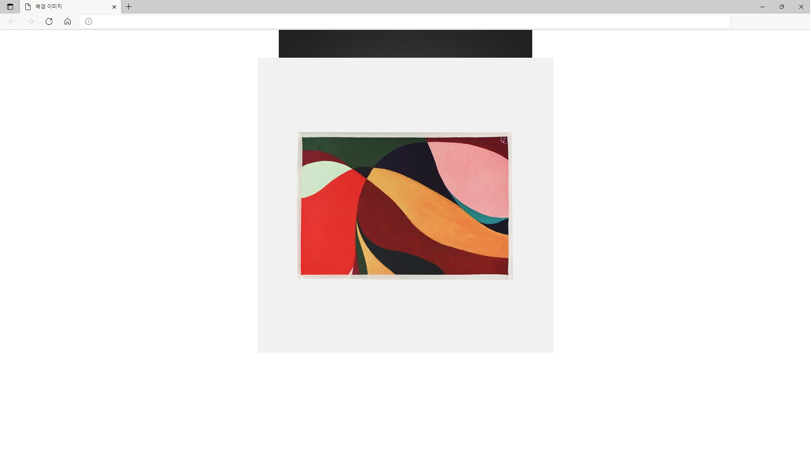
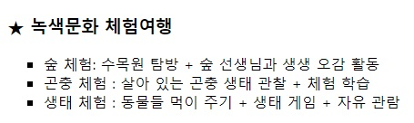
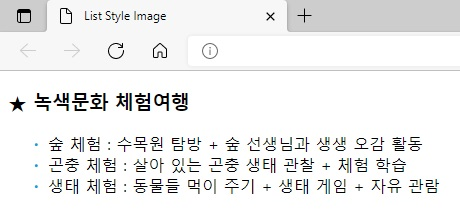

## 챕터 7
|소스 코드|페이지 수|언어|날짜|결과|설명|
|:---:|:---:|:---:|:---:|:---:|:---:|
|[background_color.html](./background_color.html)|156~157p|HTML 7 CSS|2/19/2022||.|
|[background_image.html](./background_image.html)|158~160p|HTML 7 CSS|2/19/2022||.|
|[no-repeat.html](./no-repeat.html)|160~161p|HTML 7 CSS|2/19/2022||.|
|[repeat_x.html](./repeat_x.html)|161~162p|HTML 7 CSS|2/19/2022||.|
|[background_position.html](./background_position.html)|163~164p|HTML 7 CSS|2/19/2022||.|
|[list-style-type.html](./list-style-type.html)|165~166p|HTML 7 CSS|2/19/2022||.|
|[list_style_image.html](./list_style_image.html)|166~167p|HTML 7 CSS|2/19/2022||.|