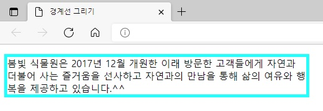
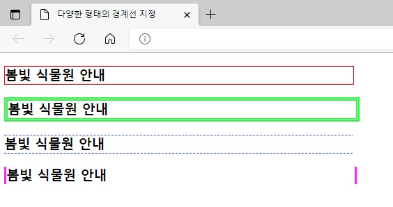
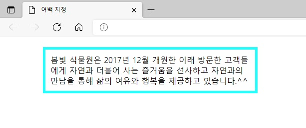
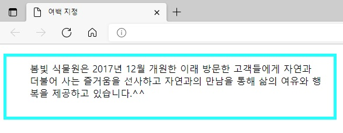
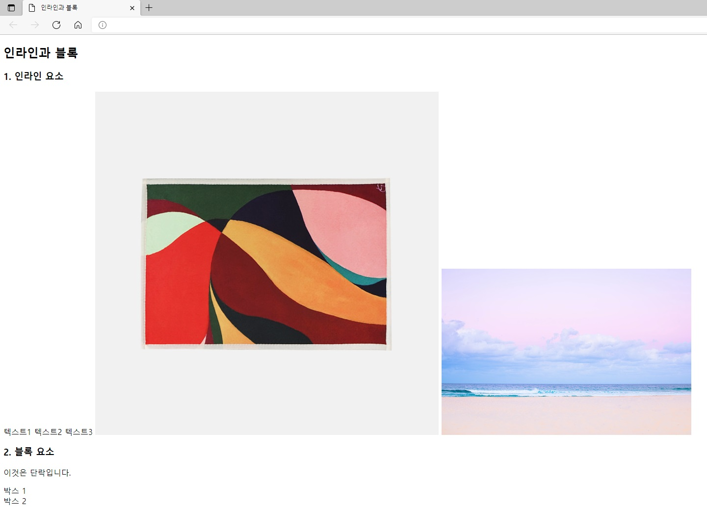
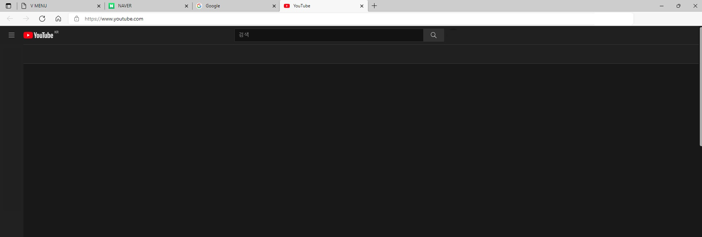
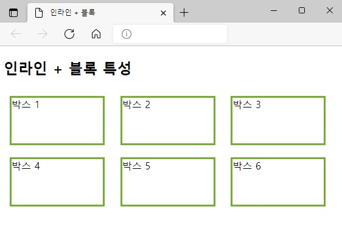

## 챕터 8
|소스 코드|페이지 수|언어|날짜|결과|설명|
|:---:|:---:|:---:|:---:|:---:|:---:|
|[border.html](../caph8/border.html)|177~178p|HTML 7 CSS|2/26/2022||.|
|[various_border.html](../caph8/various_border.html)|179~180p|HTML 7 CSS|2/26/2022||.|
|[border_radius.html](../caph8/border_radius.html)|180~182p|HTML 7 CSS|2/26/2022||.|
|[margin.html](../caph8/margin.html)|183~184p|HTML 7 CSS|2/26/2022||.|
|[padding.html](../caph8/padding.html)|185~186p|HTML 7 CSS|2/26/2022||.|
|[book_banner1.html](../caph8/book_banner1.html)|186~187p|HTML 7 CSS|2/26/2022||.|
|[book_banner2.html](../caph8/book_banner2.html)|188~189p|HTML 7 CSS|2/26/2022||.|
|[book_banner3.html](../caph8/book_banner3.html)|189~191p|HTML 7 CSS|2/26/2022||.|
|[inline_block.html](../caph8/inline_block.html)|192~193p|HTML 7 CSS|2/26/2022||.|
|[h_menu.html](../caph8/.html)|194~195p|HTML 7 CSS|2/26/2022||.|
|[v_menu.html](../caph8/v_menu.html)|196p|HTML 7 CSS|2/26/2022||.|
|"|"|"|"||Naver 클릭 시|
|"|"|"|"||Google 클릭 시|
|"|"|"|"||YouTube 클릭 시|
|[boxes.html](../caph8/boxes.html)|197~198p|HTML 7 CSS|2/26/2022||.|