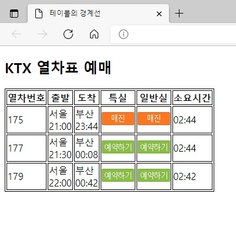
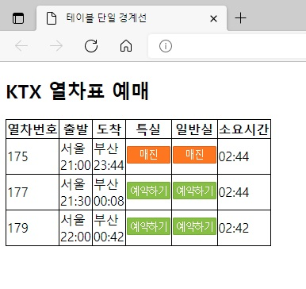
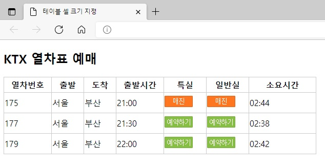
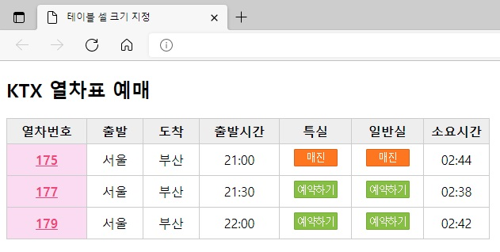

## 챕터 9
|소스 코드|페이지 수|언어|날짜|결과|설명|
|:---:|:---:|:---:|:---:|:---:|:---:|
|[table_border.html](../caph9/table_border.html)|206~208p|HTML 7 CSS|2/26/2022||.|
|[border_collapse.html](../caph9/border_collapse.html)|208p|HTML 7 CSS|2/26/2022||.|
|[table_width.html](../caph9/table_width.html)|208~211p|HTML 7 CSS|2/26/2022||.|
|[table_background.html](../caph9/table_background.html)|212~214p|HTML 7 CSS|2/26/2022||.|

### [연습 문제](../../../../tree/main/HTMLTML/caph9/pp)
|소스 코드|페이지 수|언어|날짜|결과|설명|
|:---:|:---:|:---:|:---:|:---:|:---:|