## 챕터 11
|소스 코드|페이지 수|언어|날짜|결과|설명|
|:---:|:---:|:---:|:---:|:---:|:---:|
|[html5_layout.html](./html5_layout.html)|294~298p|HTML 7 CSS|3/12/2022|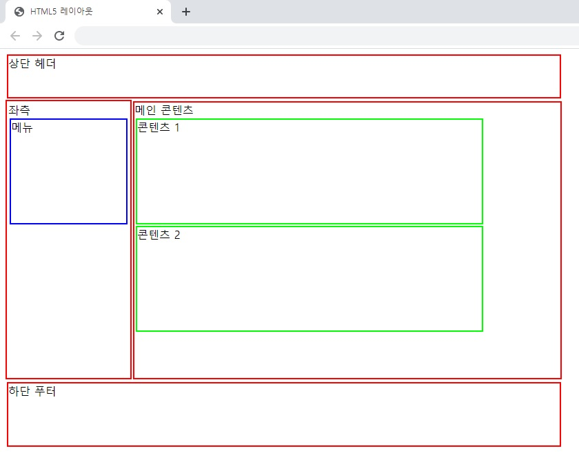|.|
|[fixed_2col.html](./fixed_2col.html)|299~302p|HTML 7 CSS|3/12/2022|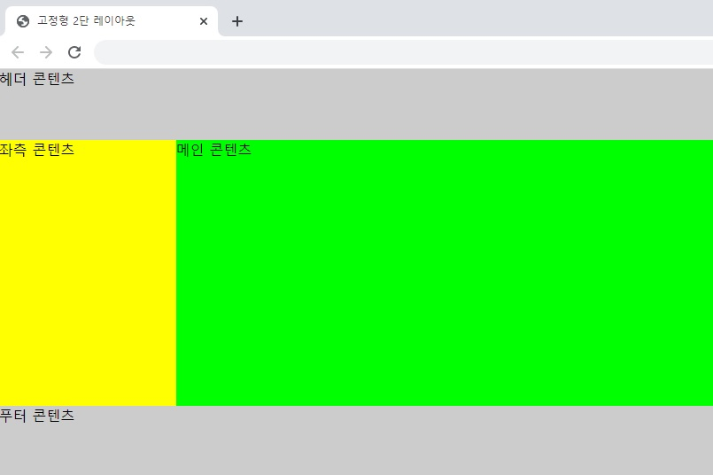|.|
|[fixed_3col.html](./fixed_3col.html)|302~304p|HTML 7 CSS|3/12/2022|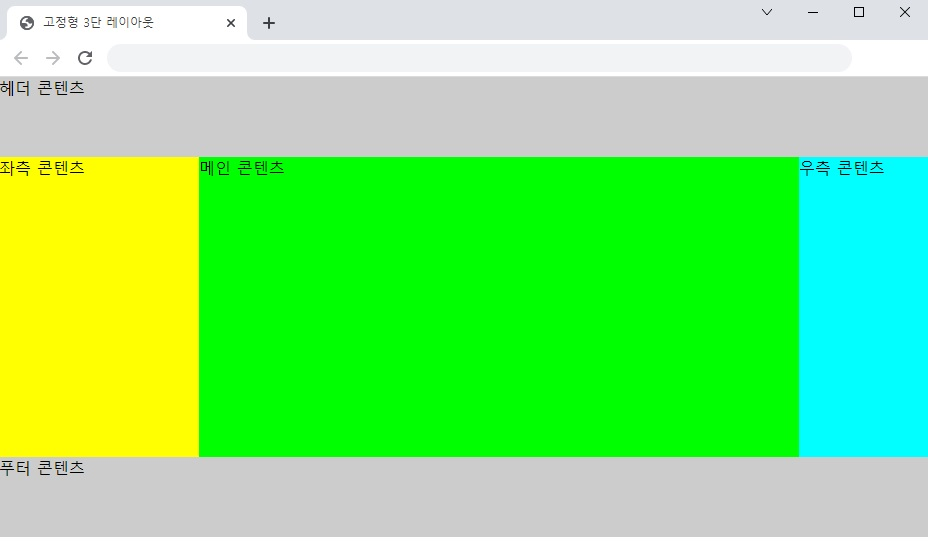|.|
|[part_fixed_2col.html](./part_fixed_2col.html)|305~307p|HTML 7 CSS|3/12/2022|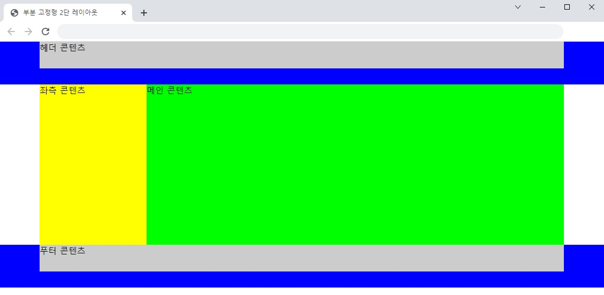|.|
|[flexible_2col.html](./flexible_2col.html)|307~309p|HTML 7 CSS|3/12/2022|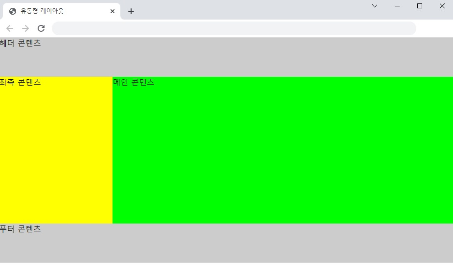|.|
|"|"|"|"|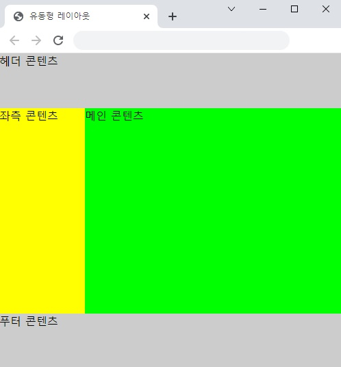|.|
|"|"|"|"|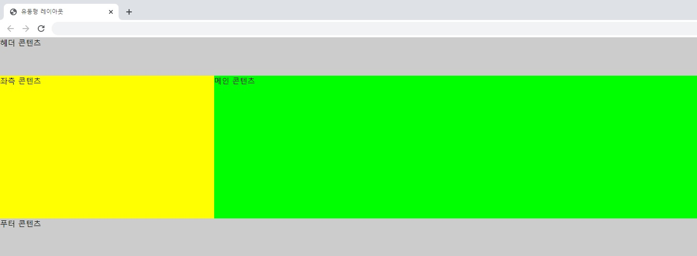|.|
|[header.html](./html/header.html)|312~315p|HTML 7 CSS|3/20/2022|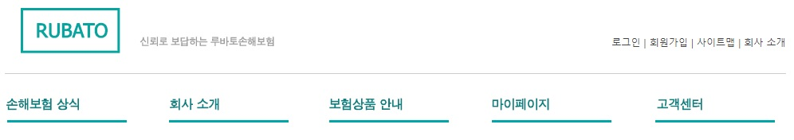|.|
|[banner.html](./html/banner.html)|316~318p|HTML 7 CSS|3/20/2022||.|
|[customer_notice_faq.html](./customer_notice_faq.html)|318~321p|HTML 7 CSS|3/27/2022|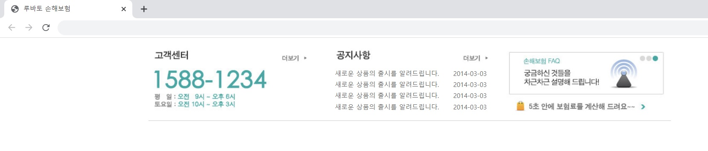|.|
|[sitemap.html](./sitemap.html)|322~325p|HTML 7 CSS|3/27/2022|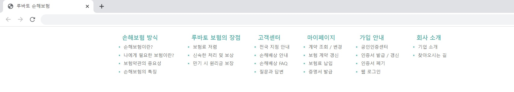|.|
|[footer.html](./footer.html)|326~328p|HTML 7 CSS|5/7/2022|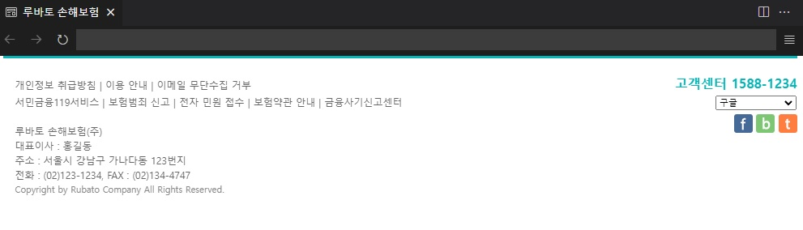|.|

### 연습 문제
|소스 코드|페이지 수|언어|날짜|결과|설명|
|:---:|:---:|:---:|:---:|:---:|:---:|
|[03.html](./pp/03.html)|335~336p|HTML 7 CSS|5/7/2022|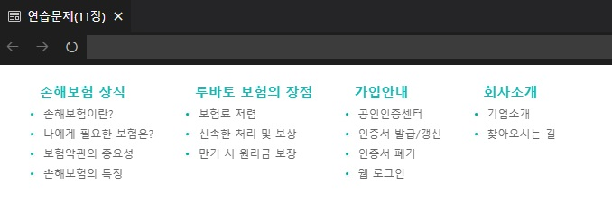|.|