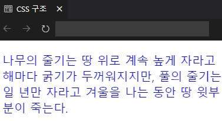
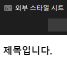
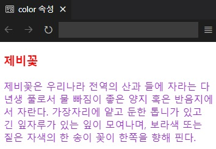
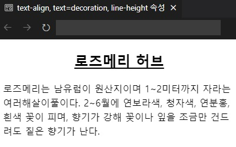
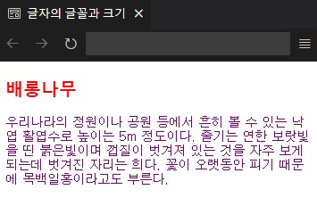
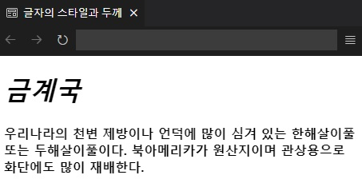
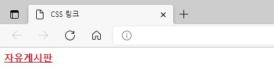
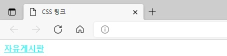
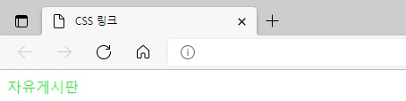
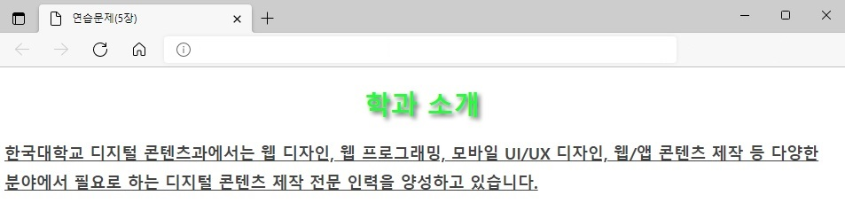

## 챕터 5
|소스 코드|페이지 수|언어|날짜|결과|설명|
|:---:|:---:|:---:|:---:|:---:|:---:|
|[css_syntax.html](./css_syntax.html)|110~111p|HTML 7 CSS|2/12/2022||.|
|[inline_style.html](./inline_style.html)|111~112p|HTML 7 CSS|2/12/2022||.|
|[internal_style.html](./internal_style.html)|113p|HTML 7 CSS|2/12/2022||.|
|[external_style.html](./external/html/external_style.html)|113~114p|HTML|2/12/2022||CSS 미적용 시|
|[mystyle.css](./external/css/mystyle.css)|113~114p|CSS|2/12/2022||CSS 적용 시|
|[color.html](./color.html)|115~116p|HTML 7 CSS|2/12/2022||.|
|[text_align.html](./text_align.html)|116~118p|HTML 7 CSS|2/12/2022||.|
|[text_shadow.html](./text_shadow.html)|118~119p|HTML 7 CSS|2/12/2022||.|
|[font_family.html](./font_family.html)|119~120p|HTML 7 CSS|2/12/2022||.|
|[font_style.html](./font_style.html)|121~122p|HTML 7 CSS|2/12/2022||.|
|[css_link.html](./css_link.html)|127~128p|HTML 7 CSS|2/19/2022||방문하기 전의 링크 텍스트|
|"|"|"|"||링크 텍스트를 마우스 포인터를 갖다 댄 상태|
|"|"|"|"||링크 텍스트를 마우스로 클릭한 순간|
|"|"|"|"||링크 텍스트를 한 번 이상 클릭한 경우|

### 연습 문제
|소스 코드|페이지 수|언어|날짜|결과|설명|
|:---:|:---:|:---:|:---:|:---:|:---:|
|[01.html](./pp/01.html)|131~132p|HTML 7 CSS|2/19/2022||.|