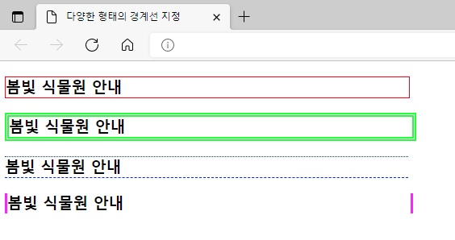
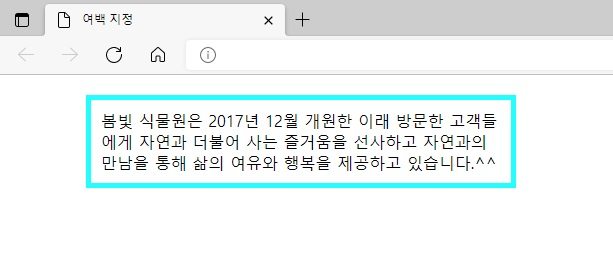
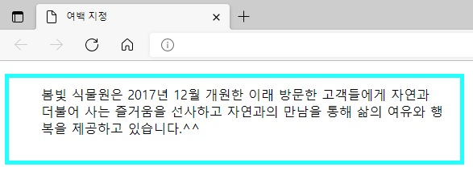
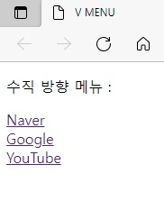
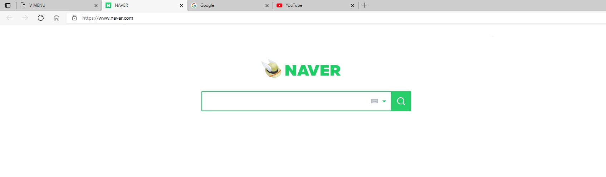
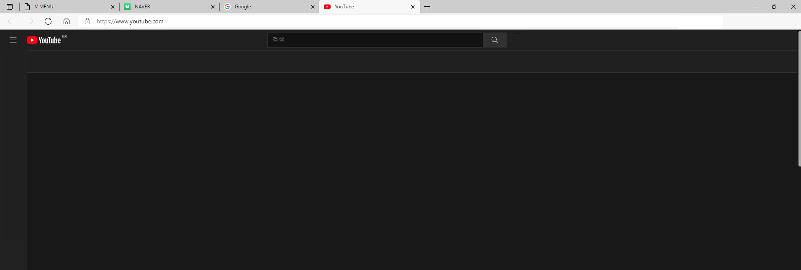

## 챕터 8
|소스 코드|페이지 수|언어|날짜|결과|설명|
|:---:|:---:|:---:|:---:|:---:|:---:|
|[border.html](./border.html)|177~178p|HTML 7 CSS|2/26/2022||.|
|[various_border.html](./various_border.html)|179~180p|HTML 7 CSS|2/26/2022||.|
|[border_radius.html](./border_radius.html)|180~182p|HTML 7 CSS|2/26/2022||.|
|[margin.html](./margin.html)|183~184p|HTML 7 CSS|2/26/2022||.|
|[padding.html](./padding.html)|185~186p|HTML 7 CSS|2/26/2022||.|
|[book_banner1.html](./book_banner1.html)|186~187p|HTML 7 CSS|2/26/2022||.|
|[book_banner2.html](./book_banner2.html)|188~189p|HTML 7 CSS|2/26/2022||.|
|[book_banner3.html](./book_banner3.html)|189~191p|HTML 7 CSS|2/26/2022||.|
|[inline_block.html](./inline_block.html)|192~193p|HTML 7 CSS|2/26/2022||.|
|[h_menu.html](./.html)|194~195p|HTML 7 CSS|2/26/2022||.|
|[v_menu.html](./v_menu.html)|196p|HTML 7 CSS|2/26/2022||.|
|"|"|"|"||Naver 클릭 시|
|"|"|"|"||Google 클릭 시|
|"|"|"|"||YouTube 클릭 시|
|[boxes.html](./boxes.html)|197~198p|HTML 7 CSS|2/26/2022||.|