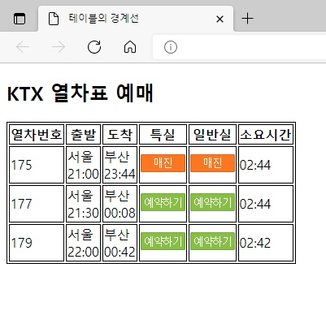
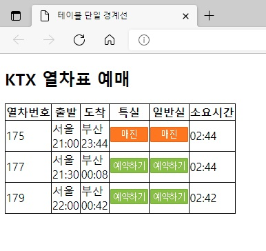
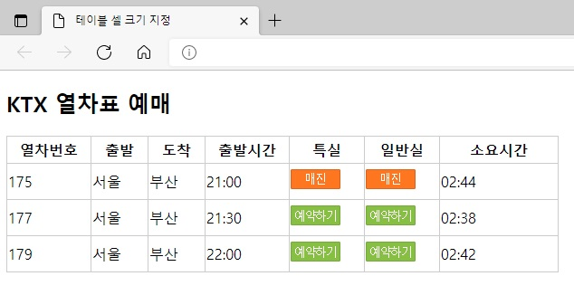
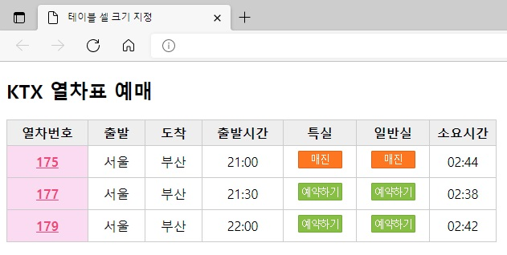
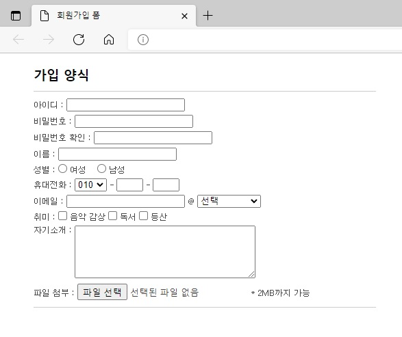
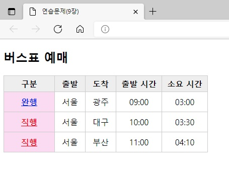

## 챕터 9
|소스 코드|페이지 수|언어|날짜|결과|설명|
|:---:|:---:|:---:|:---:|:---:|:---:|
|[table_border.html](./table_border.html)|206~208p|HTML 7 CSS|2/26/2022||.|
|[border_collapse.html](./border_collapse.html)|208p|HTML 7 CSS|2/26/2022||.|
|[table_width.html](./table_width.html)|208~211p|HTML 7 CSS|2/26/2022||.|
|[table_background.html](./table_background.html)|212~214p|HTML 7 CSS|2/26/2022||.|
|[login_form.html](./login_form.html)|223~226p|HTML 7 CSS|3/5/2022||.|
|[sign_up_form.html](./sign_up_form.html)|227~231p|HTML 7 CSS|3/5/2022||.|

### 연습 문제
|소스 코드|페이지 수|언어|날짜|결과|설명|
|:---:|:---:|:---:|:---:|:---:|:---:|
|[01.html](./pp/01.html)|246~247p|HTML 7 CSS|3/5/2022||.|