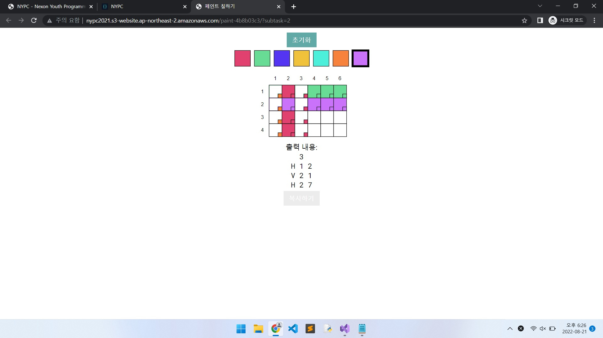

# NYPC (Nexon Youth Programming Challenge)
|소스 코드|문제 제목|문제 번호|시도 횟수|언어|날짜|설명|
|:---:|:---:|:---:|:---:|:---:|:---:|:---:|
|[race_log_verification.cpp](./race_log_verification.cpp)|레이스 기록 검증|1|1|C++|8/21/2022|1트만에 성공 ㅋ|

## 과정
|소스 코드|문제 제목|문제 번호|시도 횟수|언어|결과|날짜|설명|
|:---:|:---:|:---:|:---:|:---:|:---:|:---:|:---:|
|[fill_paint.cpp](./Footprints/fill_paint.cpp)|페인트 칠하기|2|1|C++|8/21/2022|다음에 와서 풀자..|

