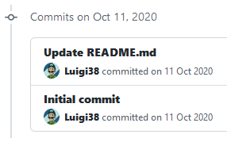

# ProjectNextop
넥스탑 👍

- [용어사전](./Documents/WordDictionary.md)
- [가장 어려웠던 문제 모음, 어떻게 풀었을까?](./Documents/HowSolved.md)
- [획기적인 기술, 우선순위 큐](./Documents/PriorityIsFun.md)
- [백엔드 모든 개념 총정리](./Documents/Backend.md)

## 바로가기
- [프로그래머스 - 코딩테스트 연습](https://programmers.co.kr/learn/challenges)

## 백준
|주제|마지막 수정 날짜|
|:---:|:---:|
|[2022년도](./Baekjoon/22/README.md)|9/14/2022|
|[2021년도](./Baekjoon/21/README.md)|9/5/2021|
|[2020년도](./Baekjoon/20/README.md)|12/14/2020|

## 프로그래머스
|주제|마지막 수정 날짜|
|:---:|:---:|
|[2021년도](./Programmers/21/README.md)|11/7/2021|

## 한국정보올림피아드
|주제|마지막 수정 날짜|
|:---:|:---:|
|[2022년도](./Koi/22/README.md)|7/25/2022|
|[2021년도](./Koi/21/README.md)|6/13/2021|
|[2020년도](./Koi/20/README.md)|5/2/2021|
|[2019년도](./Koi/19/README.md)|5/1/2022|

## USACO
|주제|마지막 수정 날짜|
|:---:|:---:|
|[2022년도](./USACO/22/README.md)|2/6/2022|
|[2021년도](./USACO/21/README.md)|12/11/2021|

## NYPC
|주제|마지막 수정 날짜|
|:---:|:---:|
|[2022년도](./NYPC/22/README.md)|8/23/2022|

## [PS Gym](https://nextop.kpscoj.com)
|주제|마지막 수정 날짜|
|:---:|:---:|
|[SILVER](./PS-Gym/Silver/README.md)|5/21/2022|

## 세부능력 및 특기사항 (DESP)
|주제|마지막 수정 날짜|
|:---:|:---:|
|[2022년도](./DESP/22/README.md)|6/1/2022|

## HTMLTML
|주제|마지막 수정 날짜|
|:---:|:---:|
|[HTML & CSS](./HTMLTML/html/README.md)|5/7/2022|
|[Javascript](./HTMLTML/javascript/README.md)|.|

## OpenCV로 배우는 컴퓨터 비전과 머신러닝
|주제|마지막 수정 날짜|
|:---:|:---:|
|[2021년도](./OpenCV/21/README.md)|2/7/2021|
|[2020년도](./OpenCV/20/README.md)|12/6/2020|

## 사이드 프로젝트
|주제|마지막 수정 날짜|
|:---:|:---:|
|[자료구조](./Data-Structure/README.md)|11/14/2020|
|[심심해서 그냥 만들어본 소소한 미니 프로젝트](./Side-Projects/README.md)|5/26/2022|
|[서울여대 정보보호영재교육원](./SWU/README.md)|5/2/2021|

## 소소한 기밀 문서
|index|데이터|설명|
|:---:|:---:|:---:|
|0|ggLNW5K1pvZcCI4h6fXUjNuRUGaaDBOrUgjoXsaCFjrF36v76OhuWM2HkQYsc51h|라고 합니다|
|.|[Advanced Encryption Standard](https://www.devglan.com/online-tools/aes-encryption-decryption)|암호화 및 복호화|
|1|Competitive Programming Helper (cph)|Visual Studio Code 확장 플러그인 (테스트)|

## 소개


2020년 10월 11일, ProjectNextop 프로젝트는 시작되었습니다.

넥스탑 정보보안 학원은 2019년부터 다녔지만 블로그로 정보 기록을 한 것은
이 때가 처음입니다.

2022년이 지나가며 곧 프로젝트 2주년을 앞두고 있습니다.
사실 유니컨버터 프로젝트는 4주년이 넘었긴 했지만, 그래도 넥스탑 정보보안 학원을 다니는 그 날까지
1주일 1커밋 이상 해보겠습니다.

감사합니다.

## 꿀팁
```c++
ios_base::sync_with_stdio(false);
cin.tie(NULL);
cout.tie(NULL);
```

=> 입출력을 전보다 빠르게 가속시킬 수 있다.

`cin` 함수 이용하고 `getline()` 함수 이용할 시 주의사항!
- `\n` 때문에 `getline()` 함수가 제대로 작동하지 않을 수 있음.

=> `cin` 함수 이용하고 `cin.ignore()` 함수를 이용하자!

- `endl` 보다 `'\n'`을 사용하기

- GitHub Repository에서 .을 누르면 Visual Studio Code 편집 가능함.

## 소스 코드 파일 이름 형식
|key|value|설명|기준|
|:---:|:---:|:---:|:---:|
|t|tried|시도한 횟수|다른 날에 코드를 짠 소스 코드 파일의 개수|
|v|version|소스 코드 버전|같은 날에 코드를 짠 소스 코드 파일의 개수|
|i|improved|개선된 코드|코드가 전에 코드를 짰을 때보다 개선된 경우|
|ni|not improved|개선되지 않은 코드|이 코드보다 개선된 코드가 있는 경우, 이 코드를 이상하게 짠 경우 (정석적이지 않은 경우)|
|d|deprecated|짜다가 버린 코드|이 코드를 짜다가 어떠한 이유로 인하여 코드를 버리게 된 경우 (멘붕)|
